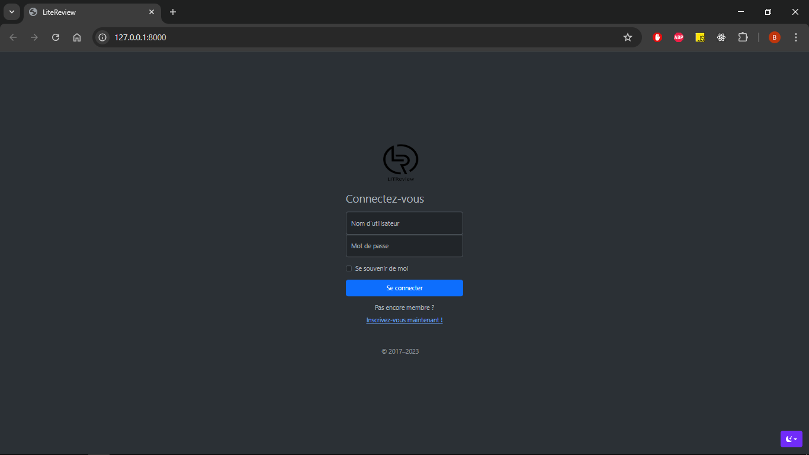
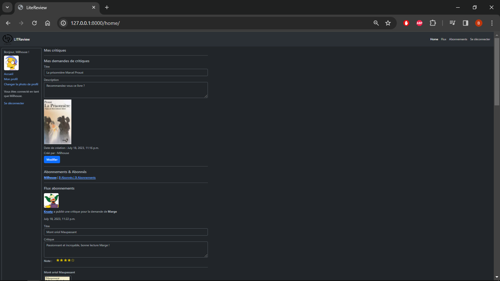
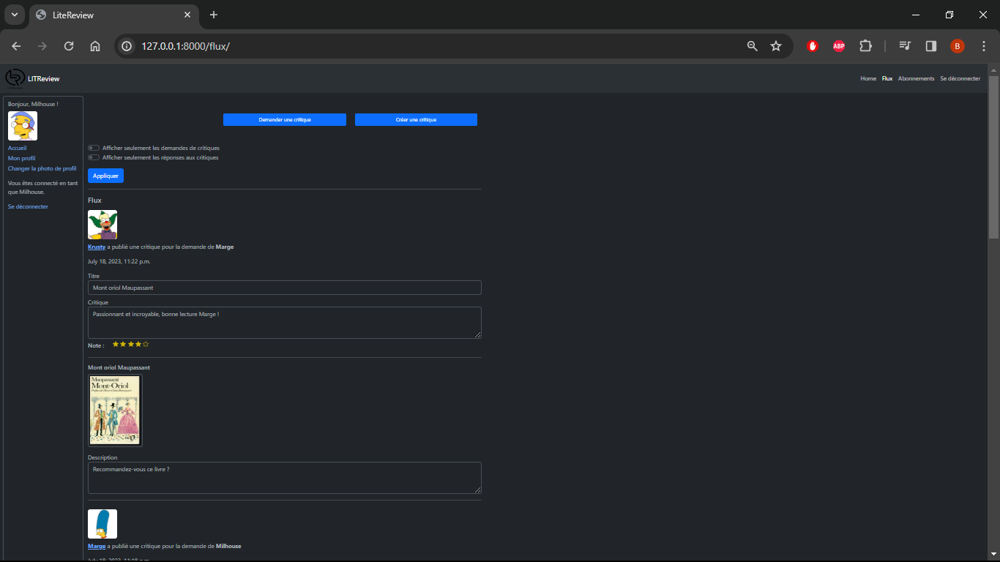

   
   
   

   

<div id="top"></div>

# Menu   

1. **[Informations générales](#informations-générales)**   
2. **[Fonctionnalitées](#fonctionnalitées)**   
3. **[Interface d'administration Django](#interface-administration-django)**  
4. **[Liste pré-requis](#liste-pre-requis)**   
5. **[Création environnement](#creation-environnement)**   
6. **[Activation environnement](#activation-environnement)**   
7. **[Installation des librairies](#installation-librairies)**   
8. **[Exécution de l'application](#execution-application)**   
9. **[Capture d'écran de l'interface](#capture-ecran)**   
10. **[Rapport avec flake8](#rapport-flake8)**   
11. **[Informations importantes sur les différents fichiers et dossiers](#informations-importantes)**   
12. **[Auteur et contact](#auteur-contact)**   

<div id="informations-générales"></div>

### Projet LITReview    

- Création d'une application web développé sur **Django** et **Bootstrap** permettant à des utilisateurs de demander des critiques de livres ou d'articles.   
- L'application est un réseau social permettant de demander et poster des critiques de livres.   

--------------------------------------------------------------------------------------------------------------------------------

<div id="fonctionnalitées"></div>
<a href="#top" style="float: right;">Retour en haut 🡅</a>

### Fonctionnalitées   

- ``Inscription`` et ``connexion``.   
- ``Consulter`` un flux personnalisé en fonction de ses abonnements.   
- ``Consulter`` un flux général répertoriant toutes les demandes et critiques.   
- ``Filtrer`` les demandes ou critiques sur chacune des pages.   
- ``Publier`` des demandes de critique.   
- ``Publier`` des critiques en réponse à une demande.   
- ``Modifier`` et ``supprimer`` ses demandes et critiques.   
- ``Consulter`` son profil, ses abonnements, changer sa photo de profil.   
- ``Consulter`` le profil et les abonnements d'un autre utilisateur.   
- ``S'abonner`` et se ``désabonner`` d'un autre utilisateur.   
- ``Rechercher`` un utilisateur.   

--------------------------------------------------------------------------------------------------------------------------------


<div id="interface-administration-django"></div>
<a href="#top" style="float: right;">Retour en haut 🡅</a>

### Interface d'administration Django    

- L'interface d'administration **Django** est disponible et fonctionnelle à l'adresse suivante   
➔ http://127.0.0.1:8000/admin/   

- ``Créer`` et ``modifier`` des utilisateurs.   
- ``Créer`` et ``modifier`` des demandes et des critiques.   
- ``Créer`` et ``modifier`` des abonnements.   


Identifiant : **Admin** | Mot de passe : **Admin123** ➔ http://127.0.0.1:8000/admin/   

#### Utilisateurs de test enregistrés dans la basse de données    

| **Identifiant** | **Mot de passe** |
|-----------------|------------------|
|    Lisa         |    Hello123      |
|    Marge        |    Hello123      |
|    Ned          |    Hello123      |
|    Milhouse     |    Hello123      |
|    Krusty       |    Hello123      |
|    Ralph        |    Hello123      |
|    Moe          |    Hello123      |

--------------------------------------------------------------------------------------------------------------------------------

<div id="liste-pre-requis"></div>
<a href="#top" style="float: right;">Retour en haut 🡅</a>

### Liste pré-requis   

Programme élaboré avec les logiciels suivants:   
- **Python** v3.7.2 choisissez la version adaptée à votre ordinateur et système.
- **Python** est disponible à l'adresse suivante ➔ https://www.python.org/downloads/    
  &nbsp;   

- **Django** 3.2.19 ➔ https://www.djangoproject.com/
- **Bootstrap** 5.3.0 ➔ https://getbootstrap.com/   
  &nbsp;   

- **Windows** 7 professionnel SP1   
- Les scripts python s'exécutent depuis un terminal.   

  - Pour ouvrir un terminal sur **Windows**, pressez la touche ```windows + r``` et entrez ```cmd```.   
  - Sur **Mac**, pressez la touche ```command + espace``` et entrez ```terminal```.   
  - Sur **Linux**, vous pouvez ouviri un terminal en pressant les touches ```Ctrl + Alt + T```.   

--------------------------------------------------------------------------------------------------------------------------------

<div id="creation-environnement"></div>
<a href="#top" style="float: right;">Retour en haut 🡅</a>

### Création de l'environnement virtuel   

- Installer une version de **Python** compatible pour votre ordinateur.   
- Une fois installer ouvrer **le cmd (terminal)** placer vous dans le dossier principal **(dossier racine)**.   

Taper dans votre terminal :   

```bash   
$ python -m venv env
```   

>*Note : Un répertoire appelé **env** doit être créé.*   

--------------------------------------------------------------------------------------------------------------------------------

<div id="activation-environnement"></div>
<a href="#top" style="float: right;">Retour en haut 🡅</a>

### Activation de l'environnement virtuel   

- Placez-vous avec le terminal dans le dossier principale **(dossier racine)**.   

Pour activer l'environnement virtuel créé, il vous suffit de taper dans votre terminal :   

```bash 
$ env\Scripts\activate.bat
```   

- Ce qui ajoutera à chaque ligne de commande de votre terminal ``(env)``.   

Pour désactiver l'environnement virtuel, il suffit de taper dans votre terminal :   

```bash  
$ deactivate
```   

--------------------------------------------------------------------------------------------------------------------------------

<div id="installation-librairies"></div>
<a href="#top" style="float: right;">Retour en haut 🡅</a>

### Installation des librairies   

- Le programme utilise plusieurs librairies externes et modules de **Python**, qui sont répertoriés dans le fichier ```requirements.txt```.   
- Placez-vous dans le dossier où se trouve le fichier ``requirements.txt`` avec le terminal, **l'environnement virtuel doit être activé**.   
- Pour faire fonctionner le programme, il vous faudra installer les librairies requises.   
- À l'aide du fichiers ``requirements.txt`` mis à disposition.   

Taper dans votre terminal la commande :   

```bash  
$ pip install -r requirements.txt
```   

--------------------------------------------------------------------------------------------------------------------------------

<div id="execution-application"></div>
<a href="#top" style="float: right;">Retour en haut 🡅</a>

### Exécution de l'application

#### Utilisation

1. Lancement du serveur **Django**.   
- Placez-vous avec le terminal dans le dossier principal ``LITReview``.   
Activer l'environnement virtuel et ensuite lancer le serveur **Django**.   

Taper dans votre terminal la commande :   

```bash
$ python manage.py runserver
```

2. Lancement de l'application dans le navigateur de votre choix.   
Se rendre à l'adresse ➔ http://127.0.0.1:8000/    

--------------------------------------------------------------------------------------------------------------------------------

<div id="capture-ecran"></div>
<a href="#top" style="float: right;">Retour en haut 🡅</a>

### Interface de l'application   

. **Capture d'écran de la page de connexion**   

   

>*Note : Créer ou utiliser un utilisateur déja présent dans la base de données.*   

. **Capture d'écran du menu home.**   

   

. **Capture d'écran du menu flux.**   

   

. **Capture d'écran du menu des abonnements.**   

   

**Navigateur.**   
>*Note : Les tests ont était fait sur Firefox et Google Chrome.*   

--------------------------------------------------------------------------------------------------------------------------------

<div id="rapport-flake8"></div>
<a href="#top" style="float: right;">Retour en haut 🡅</a>

### Rapport avec flake8   

- Le repository contient un rapport **flake8**, qui renvoi ```All good! No flake8 errors found in 20 files scanned``` ➔ ([flake-report](flake-report))   

```html   
<div id="all-good">
    <span class="count sev-4">
      <span class="tick">&#x2713;</span>
    </span>
    <h2>All good!</h2>
    <p>No flake8 errors found in 20 files scanned.</p>
</div>
``` 

- Il est possible d'en générer un nouveau en installant le module ```flake8``` s'il n'est pas installé.   

Installation de **flake8** en entrant dans votre terminal la commande :   

```bash
pip install flake8-html
```
- Créer un fichier ```.flake8``` si il n'existe pas.   
- Ecrire le texte suivant dedans :   

```bash
[flake8]
exclude = .git, env, .gitignore, static, node_modules, static, service/admin.py, *tests.py, **/templates/, **/migrations/
max-line-length = 119
ignore = F401, F841, F821
```

Tapez dans votre terminal la commande :   

```bash
flake8 --format=html --htmldir=flake-report
```
- Un rapport sera généré dans le dossier ``flake-report``.   

--------------------------------------------------------------------------------------------------------------------------------

<div id="informations-importantes"></div>
<a href="#top" style="float: right;">Retour en haut 🡅</a>

### Informations importantes sur les différents fichiers et dossiers   

**Le dossier ``authentication``**   
Le dossier est une apps **Django** qui contient :   

  - Un dossier ```migrations``` contenant les fichiers de configuration pour la base de données. ➔ ([migrations](authentication/migrations))   
  - Un dossier ```templates``` contenant les gabarits html. ➔ ([templates](authentication/templates/authentication))   
  - Á la racine du dossier ```authentication``` les fichiers tels que views.py, models.py, forms.py. ➔ ([authentication](authentication))   

**Le dossier ``service``**   
  Le dossier est une apps **Django** qui contient :   

  - Un dossier ```migrations``` contenant les fichiers de configuration pour la base de données. ➔ ([migrations](service/migrations))   
  - Un dossier ```templates``` contenant les gabarits html. ➔ ([templates](service/templates/service))   
  - Á la racine du dossier ```service``` les fichiers tels que views.py, models.py, forms.py. ➔ ([service](service))   
    
  - Un dossier ```partials``` contenant les snippets utilisés. ➔ ([partials](service/templates/service/partials))   
  - Un dossier ```templatetags``` contenant service_extras.py pour des filtres personnalisés. ➔ ([templatetags](service/templatetags))   

**Le dossier ``media``**   

  - Dossier ou sont stockés les fichiers images des utilisateurs.   

**Le dossier ``node_modules``**   

  - Dossier des téléchargements des outils tels que **Boostrap**.   

**Le dossier ``static``**   

  - Dossier qui contient les differents fichiers de configuration ``CSS`` et ``JS`` lié à ``Bootstrap``.   

**Le fichier ``package.json``**   

  - Contient la configurations du projet, les dépendances, les versions.

--------------------------------------------------------------------------------------------------------------------------------

<div id="auteur-contact"></div>
<a href="#top" style="float: right;">Retour en haut 🡅</a>

### Auteur et contact   
Pour toute information supplémentaire, vous pouvez me contacter.   
**Bubhux:** bubhuxpaindepice@gmail.com   
